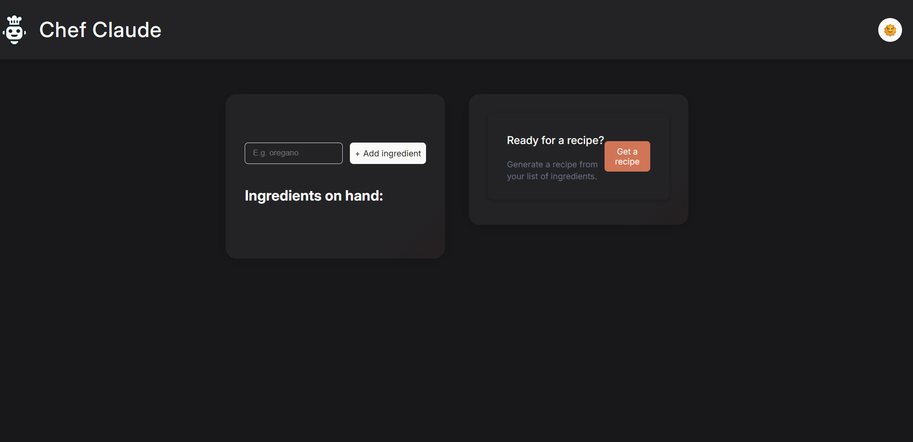
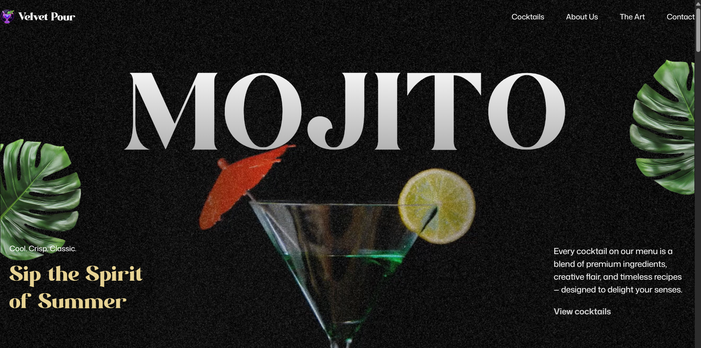
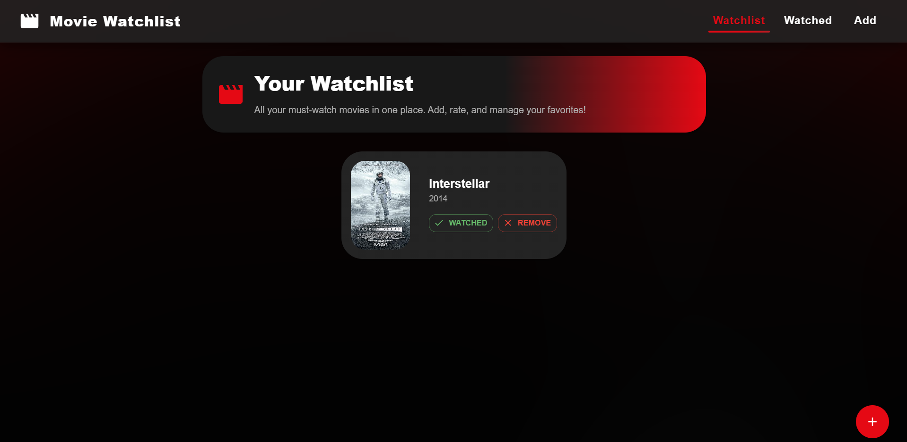

# Portfolio

A minimal, modern portfolio website built with **Next.js** and **Tailwind CSS**.

<p align="center">
  
  
  
</p>

---

## Features

- Responsive, clean design
- Sections for Hero, Projects, Skills, and Contact

## Getting Started

1. **Install dependencies:**
    ```bash
    npm install
    ```
2. **Run the development server:**
    ```bash
    npm run dev
    ```
3. Open [http://localhost:3000](http://localhost:3000) in your browser.

## Project Structure

```
app/
  components/         // UI sections
  globals.css         // Global styles
  layout.tsx          // App layout
  page.tsx            // Main page
public/               // Static assets (images, resume, etc.)
```

## License

MIT
